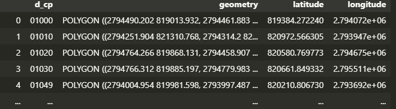

# Proyecto personal QGIS
## *Introduccion*
QGIS es un cliente GIS de código abierto fácil de usar, donde puede visualizar, administrar, editar, analizar datos y componer mapas imprimibles. Incluye una poderosa funcionalidad analítica a través de la integración con GRASS, SAGA, Orfeo Toolbox , GDAL/OGR y muchos otros proveedores de algoritmos.
Centros de Integración Juvenil (CIJ) es una asociación civil mexicana, no lucrativa, incorporada al Sector Salud, que cuenta con más de 50 años de experiencia en la prevención, tratamiento y rehabilitación de las conductas adictivas y otros problemas de salud mental. El proyecto trata sobre encontrar la relacion entre consumidores y ver cuanta densidad de areas verdes le rodean en su codigo postal.
## *Desarrollo*
Los archivos shapefile(Formato sencillo y no topológico que se utiliza para almacenar la ubicación geométrica y la información de atributos de las entidades geográficas.) se obtuvieron de la pagina oficial del gobierno de la ciudad de Mexico entre otras paginas oficiales. En la parte de backend se desarrollo en el lenguaje de programacion python con el apoyo en las librerias de geopandas y shapely.

### *Backend*
```
import geopandas as gpd
from shapely import wkt

#Se lee el archivo shapefile de las áreas verdes y se guarda en la variable areas_verdes_shp 
areas_verdes_shp = gpd.read_file('inventario_areas_verdes_1\inventario_areas_verdes_1.shp')

#Se imprime el encabezado del archivo shapefile
areas_verdes_shp.head()
```

```
#Se generan los centros de los polígonos
areas_verdes_shp['centroid'] = areas_verdes_shp.geometry.centroid
#Se obtienen las coordenadas de los centros de los polígonos
areas_verdes_shp['latitude'] = areas_verdes_shp.centroid.y
areas_verdes_shp['longitude'] = areas_verdes_shp.centroid.x
#Dropeamos la columna centroid porque al exportar el archivo tenemos problemas porque solo soporta un tipo de geometría
areas_verdes_shp.drop(columns=['centroid'], inplace=True)
```


```
#Leemos el archivo shapefile de codigos postales en cdmx y lo guardamos en la variable codigos_postales
codigos_postales_shp = gpd.read_file('cp_cdmx\CP_09CDMX_v7.shp')
#Se imprime el encabezado del archivo shapefile
codigos_postales_shp.head()
```


```
#Se generan los centros de los polígonos
codigos_postales_shp['centroid'] = codigos_postales_shp.geometry.centroid
#Se obtienen las coordenadas de los centros de los polígonos
codigos_postales_shp['latitude'] = codigos_postales_shp.centroid.y
codigos_postales_shp['longitude'] = codigos_postales_shp.centroid.x
#Dropeamos la columna centroid porque al exportar el archivo tenemos problemas porque solo soporta un tipo de geometría
codigos_postales_shp.drop(columns=['centroid'], inplace=True)
codigos_postales_shp.to_file('Nuevo_cp_cdmx/codigos_postales_con_coordenadas.shp')
codigos_postales_shp.head()
```


Este fue el mapa que obtuvimos en QGIS 


## *Bibliografia*
###### https://live.osgeo.org/es/overview/qgis_overview.html
###### https://desktop.arcgis.com/es/arcmap/latest/manage-data/shapefiles/what-is-a-shapefile.htm
###### https://datos.cdmx.gob.mx/dataset/inventario-de-areas-verdes-en-la-ciudad-de-mexico
###### https://datos.cdmx.gob.mx/dataset/codigos-postales


